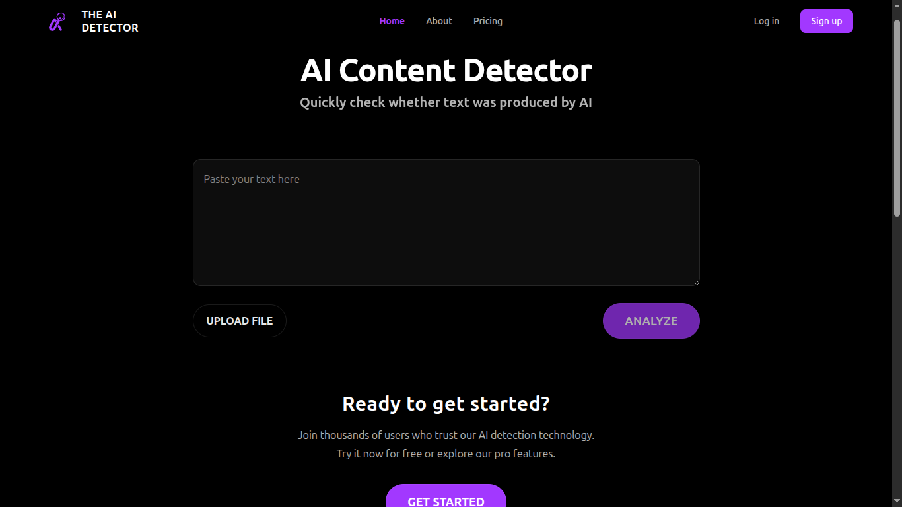
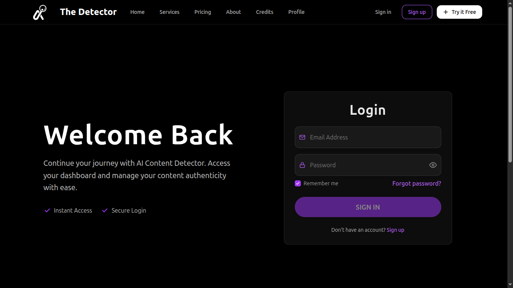
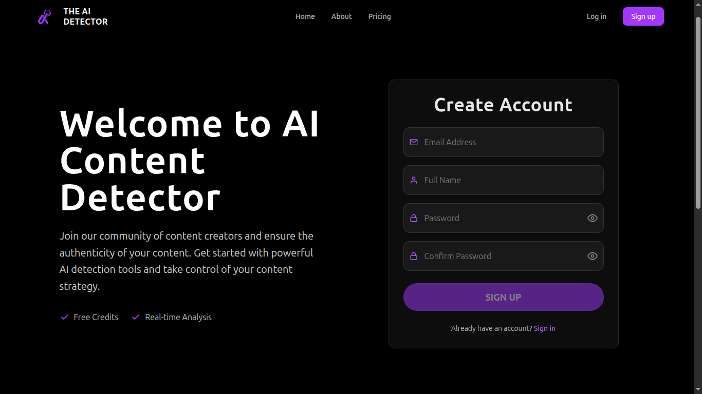

# 🔍 AI Content Detector v1.1.0

A sophisticated web application powered by OpenAI's [RoBERTa-based model](https://huggingface.co/roberta-base-openai-detector) for real-time detection of AI-generated content with advanced analysis capabilities. Built with [PyTorch](https://pytorch.org/) and [🤗 Transformers](https://huggingface.co/docs/transformers/index) 

## 📸 Screenshots


### Home Page

*Landing page with instant analysis capability*

### Login Page

*Secure email & password authentication*

### Sign Up Page

*Simple email registration process*

## 🚀 Latest Updates

### New Features
- **Enhanced UI/UX**
  - Modern dark theme with accent colors
  - Responsive design for all devices
  - Improved navigation and layout
- **Authentication System**
  - Email & password authentication
  - Secure JWT-based sessions
  - Protected routes and content
- **Real-time Analysis**
  - Instant text analysis
  - File upload support
  - Batch processing capabilities

### Technical Improvements
- **Frontend Architecture**
  - New component structure
  - Context-based state management
  - TypeScript strict mode
- **Backend Enhancements**
  - Improved error handling
  - Rate limiting
  - Monitoring system

## 🛠 Core Features

### Free Features
- Real-time AI content detection
- Text and file analysis
- Basic report generation
- Up to 2000 characters per analysis

### Premium Features
- Unlimited character count
- Batch processing
- Advanced analytics
- API access
- History tracking

## 💻 Tech Stack

### Core Technologies
[](https://www.typescriptlang.org/)
[](https://reactjs.org/)
[](https://fastapi.tiangolo.com/)
[](https://tailwindcss.com/)
[](https://www.python.org/)

### System Features
- Comprehensive monitoring system
  - Real-time performance metrics
  - Health check endpoints
  - Error tracking and alerts
  - Resource usage monitoring
- Advanced file processing
  - Memory-efficient batch processing
  - Metadata extraction
  - Content sanitization
  - File type validation
- Robust error handling
  - Detailed error tracking
  - Structured logging
  - Request ID tracking
  - Alert notifications
- Performance optimization
  - Async file processing
  - Concurrent batch operations
  - Resource usage monitoring
  - Rate limiting

### Frontend
- **React 18** with TypeScript
- **TailwindCSS** for styling
- **Context API** for state management
- **React Router v6** for navigation

### Backend
- **FastAPI** framework
- **PostgreSQL** with SQLAlchemy ORM
- **JWT** token-based auth
- **bcrypt** password hashing
- **Prometheus** monitoring

## 📦 Project Structure

Key directories and their purposes:

```
📂 ai-content-detector/
 ├── 📂 frontend/                # React application
 │   ├── 📂 src/
 │   │   ├── 📂 components/     # Reusable UI components
 │   │   ├── 📂 context/        # React contexts
 │   │   ├── 📂 hooks/          # Custom hooks
 │   │   └── 📂 pages/          # Route components
 │   └── 📂 public/             # Static assets
 │
 └── 📂 backend/                # FastAPI application
     ├── 📂 app/
     │   ├──  api/            # API endpoints
     │   ├── 📂 models/         # Data models
     │   └── 📂 utils/          # Utilities
     └── 📂 tests/              # Test suite
```

##  Getting Started

### Prerequisites
- Node.js (v16+)
- Python (v3.10+)
- npm or yarn
- Git

### Installation

1. Clone the repository
```bash
git clone https://github.com/boulahya01/ai-content-detector-v1.1.git
cd ai-content-detector-v1.1
```

2. Backend Setup
```bash
cd backend
python -m venv venv
source venv/bin/activate  # On Windows use: venv\Scripts\activate
pip install -r requirements.txt
```

3. Configure Environment Variables

The application requires environment variables to be set up for both backend and frontend. Example configuration files are provided:

#### Backend Configuration
Copy `backend/.env.example` to `backend/.env` and configure:
- `JWT_SECRET_KEY`: Secret key for JWT token generation (keep this secure!)
- `JWT_REFRESH_SECRET_KEY`: Secret key for refresh tokens (keep this secure!)
- `ACCESS_TOKEN_EXPIRE_MINUTES`: Token expiration time in minutes
- `DATABASE_URL`: Database connection string
- `FRONTEND_URL`: URL of the frontend application (for CORS)
- `SMTP_*`: Email configuration (optional, for notifications)

#### Frontend Configuration
Copy `frontend/.env.example` to `frontend/.env` and configure:
- `VITE_API_URL`: Backend API endpoint
- `VITE_JWT_EXPIRES_IN`: JWT token expiration time
- `VITE_REFRESH_TOKEN_EXPIRES_IN`: Refresh token expiration time

⚠️ **Security Notes**:
- Never commit `.env` files to version control
- Use strong, unique secrets in production
- Keep production credentials strictly confidential
- Regularly rotate security keys and credentials

4. Additional Configuration
   - Configure logging levels in `utils/logging_config.py`
   - Set rate limits in `utils/rate_limiter.py`
   - Review CORS settings in `main.py` if needed

5. Frontend Setup
```bash
cd frontend
npm install  # or yarn install
```

### Running the Application

1. Initialize the Database
```bash
cd backend
# Run database migrations
alembic upgrade head
```

2. Start the Backend
```bash
# Start with monitoring and logging configuration
uvicorn app.main:app --reload --port 8000 --log-config utils/logging_config.py
```

3. Access Monitoring
   - Health check: `http://localhost:8000/health`
   - Metrics: `http://localhost:8000/metrics`
   - Logs: Check `backend/logs/` directory

3. Start the Frontend
```bash
cd frontend
npm run dev  # or yarn dev
```

The application will be available at `http://localhost:5173`

### Monitoring Setup

1. View System Health
   - GET `/health` for overall system status
   - GET `/metrics` for Prometheus metrics
   - Check log files in `backend/logs/`

2. Available Metrics
   - Request latency
   - Error rates
   - Detection confidence scores
   - Resource usage
   - Batch processing status

3. Log Files
   - `error.log`: Error-level messages
   - `info.log`: Information and warnings
   - `debug.log`: Detailed debugging info

##  Usage

1. **Analyze Content**
   - Visit the homepage
   - Enter text or upload a file (.txt, .docx)
   - Get instant AI detection results

2. **Premium Features** (requires login)
   - Save analysis history
   - Access advanced detection features
   - Manage subscription plans

##  Development Notes

### Provider Structure
```
AuthProvider
  └─ SubscriptionProvider
      └─ AnalysisProvider
          └─ Layout
              └─ Routes
```

### Known Issues & Fixes
- Fixed React render crash with Radix `Slot` (Button/Link pattern)
- Added comprehensive error boundaries
- Improved type checking and validation

##  Contributing

1. Fork the repository
2. Create your feature branch (`git checkout -b feature/amazing-feature`)
3. Commit your changes (`git commit -m 'Add amazing feature'`)
4. Push to the branch (`git push origin feature/amazing-feature`)
5. Open a Pull Request

##  License

This project is licensed under the MIT License - see the [LICENSE](LICENSE) file for details.

##  Acknowledgments

- [FastAPI](https://fastapi.tiangolo.com/) for the excellent API framework
- [React](https://reactjs.org/) for the powerful UI library
- [TailwindCSS](https://tailwindcss.com/) for the utility-first CSS framework