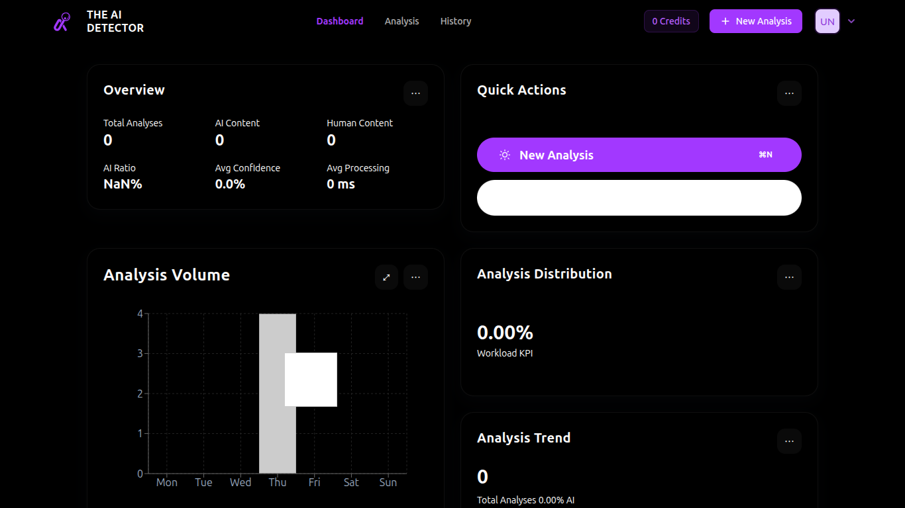
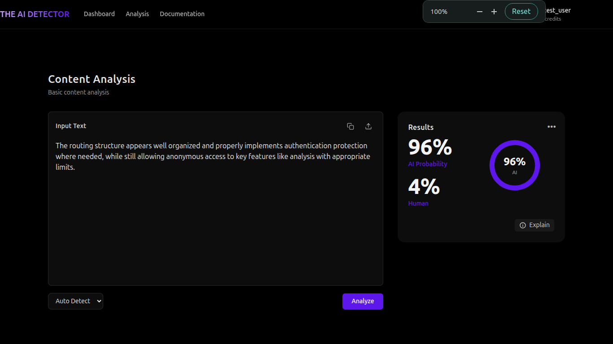
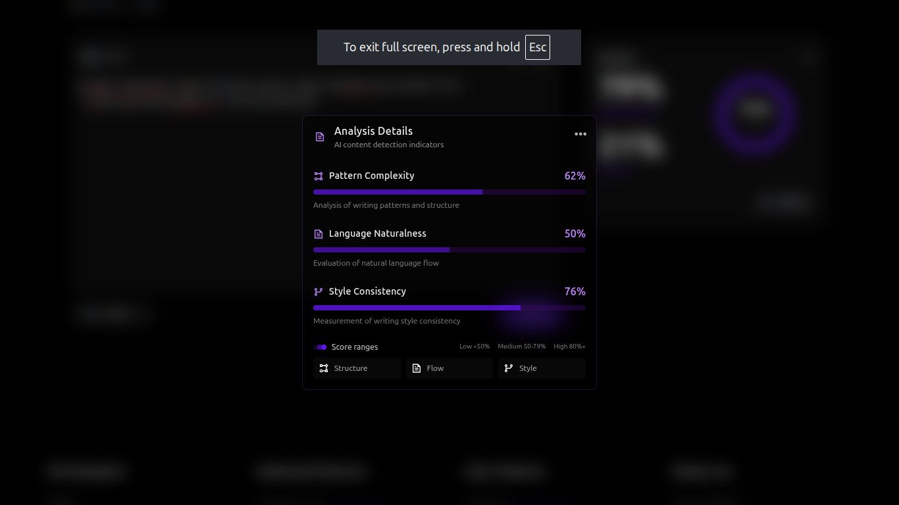
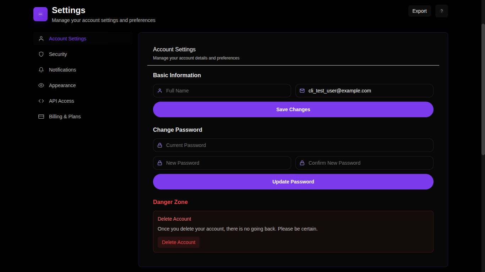
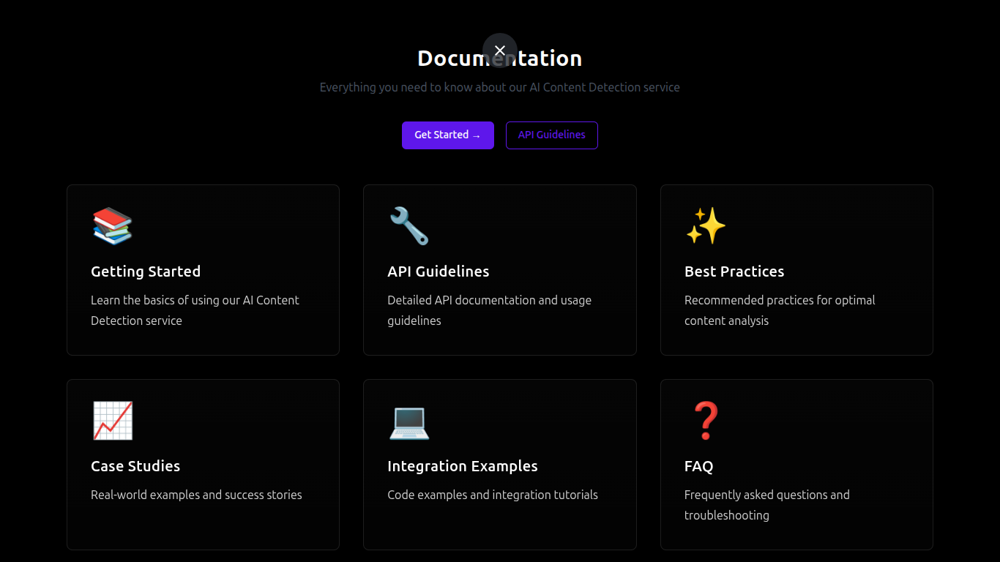

# 🤖 The AI Detector

<div align="center">

[](https://www.typescriptlang.org/)
[](https://reactjs.org/)
[](https://www.python.org/)
[](https://fastapi.tiangolo.com/)
[](https://www.postgresql.org/)
[](https://tailwindcss.com/)
[](https://vitejs.dev/)
[](https://www.docker.com/)

### 🔍 Advanced AI Content Detection Platform

*Powered by state-of-the-art machine learning for unparalleled accuracy in detecting AI-generated content*

[](https://opensource.org/licenses/MIT)
[](https://semver.org)

[📚 Features](#-features) •
[📸 Screenshots](#-screenshots) •
[⚡ Tech Stack](#-tech-stack) •
[🏗 Architecture](#-architecture) •
[🚀 Getting Started](#-getting-started) •
[📖 Documentation](#-documentation)


*Modern and intuitive landing page with real-time analysis capabilities*

</div>

## ✨ Features

### 🎯 Core Capabilities
- **🤖 State-of-the-art Detection**
  - RoBERTa-based ML models
  - Advanced pattern recognition
  - Contextual analysis
  - High accuracy rates

- **🌍 Multi-language Support**
  - Automatic language detection
  - Cross-lingual analysis
  - Region-specific models
  - UTF-8 encoding support

- **⚡ Real-time Analysis**
  - Instant content verification
  - Live confidence scores
  - Interactive feedback
  - WebSocket updates

- **📦 Batch Processing**
  - Multiple document handling
  - Parallel processing
  - Progress tracking
  - Bulk export options

### 🛡️ Security & Authentication
- **🔑 JWT Authentication**
  - Secure token management
  - Refresh token rotation
  - Session tracking
  - Multi-device support

- **👥 Role-based Access**
  - Custom permissions
  - User groups
  - Access levels
  - Activity logging

- **🔒 API Security**
  - Key management
  - Request signing
  - CORS protection
  - Rate limiting

### 💼 Business Features
- **💳 Credits System**
  - Flexible pricing
  - Usage tracking
  - Auto-replenishment
  - Credit alerts

- **📊 Analytics**
  - Usage metrics
  - Performance tracking
  - Custom reports
  - Export capabilities

### 🎨 User Experience
- **📱 Responsive Design**
  - Mobile-first approach
  - Adaptive layouts
  - Touch optimized
  - Cross-browser support

- **🌓 Theme System**
  - Dark/Light modes
  - Custom color schemes
  - Branded themes
  - Accessibility support

## 📸 Screenshots

### Core Features
<table>
<tr>
<td width="50%">

### 📊 Dashboard

*Comprehensive analytics dashboard with real-time metrics and activity tracking*

</td>
<td width="50%">

### 🔍 Analysis Interface

*Advanced content analysis with confidence scoring and pattern detection*

</td>
</tr>
<tr>
<td width="50%">

### 📝 Results Breakdown

*Detailed analysis explanation with AI probability markers and confidence metrics*

</td>
<td width="50%">

### ⚙️ Settings Panel

*Comprehensive settings interface with modular configuration options*

</td>
</tr>
<tr>
<td width="50%">

### 🔐 Authentication

*Secure authentication with social login options and 2FA support*

</td>
<td width="50%">

### 📚 Documentation

*Interactive API documentation with code examples and integration guides*

</td>
</tr>
</table>

## 🛠 Tech Stack

### 🎨 Frontend Technologies
```plaintext
├── 🔷 Core
│   ├── React 18
│   ├── TypeScript 5
│   └── Vite 4
│
├── 🎨 Styling
│   ├── TailwindCSS
│   ├── CSS Modules
│   └── CSS Variables
│
├── 📦 State Management
│   ├── Context API
│   ├── Custom Hooks
│   └── Local Storage
│
├── 🔌 Data Fetching
│   ├── Axios
│   ├── WebSocket
│   └── Query Caching
│
└── 📱 UI/UX
    ├── Radix UI
    ├── Custom Components
    └── Responsive Design
```

### ⚙️ Backend Technologies
```plaintext
├── 🐍 Core
│   ├── FastAPI
│   ├── Python 3.10+
│   └── Pydantic
│
├── 🗄️ Data Layer
│   ├── PostgreSQL
│   ├── SQLAlchemy
│   └── Alembic
│
├── 🤖 ML Stack
│   ├── PyTorch
│   ├── Transformers
│   └── scikit-learn
│
└── 🔧 Infrastructure
    ├── Redis Cache
    ├── Celery
    └── Docker
```

## 📐 Architecture

### 📁 Project Structure
```plaintext
ai-content-detector/
├── 📱 frontend/          # React + TypeScript application
├── ⚙️ backend/           # FastAPI + Python service
├── 📚 docs/             # Documentation
└── 🛠️ scripts/          # Utility scripts
```

### 🎨 Frontend Structure
```plaintext
frontend/
├── 📂 src/
│   ├── 🔌 api/              # API integration
│   │   ├── analysis.ts      # Analysis endpoints
│   │   ├── auth.ts          # Authentication
│   │   └── shobeis.ts       # Credits system
│   │
│   ├── 🧩 components/       # React components
│   │   ├── analysis/        # Analysis features
│   │   │   ├── TextAnalyzer.tsx
│   │   │   └── ResultsDisplay.tsx
│   │   │
│   │   ├── auth/           # Authentication
│   │   │   ├── LoginForm.tsx
│   │   │   └── RegisterForm.tsx
│   │   │
│   │   ├── dashboard/      # Dashboard
│   │   │   ├── StatsCard.tsx
│   │   │   └── ActivityList.tsx
│   │   │
│   │   └── ui/            # Shared components
│   │       ├── Button.tsx
│   │       └── Card.tsx
│   │
│   ├── 🌍 context/         # React contexts
│   │   ├── AuthContext.tsx
│   │   └── AnalysisContext.tsx
│   │
│   ├── 🎣 hooks/           # Custom hooks
│   │   ├── useAuth.ts
│   │   └── useAnalysis.ts
│   │
│   ├── 📄 pages/           # Route pages
│   │   ├── HomePage.tsx
│   │   └── AnalysisPage.tsx
│   │
│   ├── 🎨 styles/          # Styling
│   │   ├── index.css
│   │   └── theme.css
│   │
│   └── 🛠️ utils/           # Utilities
│       ├── api.ts
│       └── validation.ts
│
└── 📦 public/              # Static assets
```

### ⚙️ Backend Structure
```plaintext
backend/
├── 📂 app/
│   ├── 🔌 api/            # API endpoints
│   │   ├── analytics.py   # Analytics routes
│   │   ├── analyze.py     # Analysis engine
│   │   ├── auth.py       # Authentication
│   │   └── shobeis.py    # Credits system
│   │
│   ├── 📊 models/         # Database models
│   │   ├── user.py       # User model
│   │   ├── analyzer.py   # Analysis model
│   │   └── pricing.py    # Pricing model
│   │
│   ├── 🔧 services/       # Business logic
│   │   ├── analytics_service.py
│   │   └── shobeis_service.py
│   │
│   └── 🛠️ utils/          # Utilities
│       ├── security.py
│       └── validation.py
│
├── 🧪 tests/              # Test suite
│   ├── test_analyzer.py
│   └── test_auth.py
│
└── 🗄️ migrations/         # Database migrations
    └── versions/
```

## 🚀 Getting Started

### Prerequisites
- Node.js 16+
- Python 3.10+
- PostgreSQL 13+
- Redis (optional)

### Quick Start
```bash
# Clone repository
git clone https://github.com/boulahya01/the-ai-detector.git
cd the-ai-detector

# Backend setup
cd backend
python -m venv venv
source venv/bin/activate  # Windows: venv\Scripts\activate
pip install -r requirements.txt

# Frontend setup
cd frontend
npm install

# Start development servers
cd backend && uvicorn app.main:app --reload
cd frontend && npm run dev
```

## 📊 Technology Distribution

```plaintext
📊 Language Statistics
├── TypeScript  45.0% ████████████████████░░░░░░░░░░
├── Python     40.0% ██████████████████░░░░░░░░░░░░
├── SQL         8.0% ████░░░░░░░░░░░░░░░░░░░░░░░░░
├── CSS         5.0% ██░░░░░░░░░░░░░░░░░░░░░░░░░░░
└── Shell       2.0% █░░░░░░░░░░░░░░░░░░░░░░░░░░░░
```

## 📖 Documentation

- [📚 API Reference](./docs/api/README.md)
- [💻 Development Guide](./docs/guides/development.md)
- [🚀 Deployment Guide](./docs/guides/deployment.md)
- [🤝 Contributing Guide](./CONTRIBUTING.md)

## 🤝 Contributing

1. 🍴 Fork the repository
2. 🌿 Create your feature branch (`git checkout -b feature/amazing-feature`)
3. 💾 Commit your changes (`git commit -m 'feat: Add amazing feature'`)
4. 📤 Push to the branch (`git push origin feature/amazing-feature`)
5. 🔍 Open a Pull Request

Please read [CONTRIBUTING.md](CONTRIBUTING.md) for detailed guidelines.

## 📄 License

This project is licensed under the MIT License - see the [LICENSE](LICENSE) file for details.

---

<p align="center">
  Made with ❤️ by <a href="https://github.com/boulahya01">boulahya01</a>
  <br/>
  © 2025 AI Detector. All rights reserved.
</p>